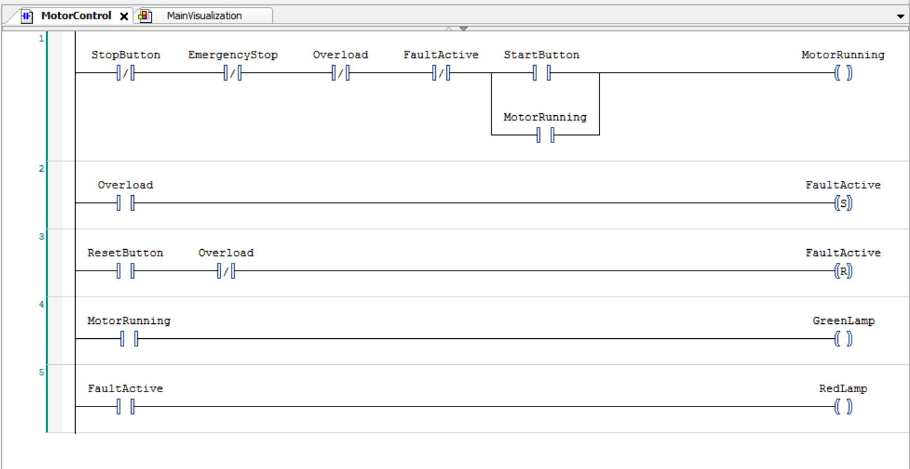
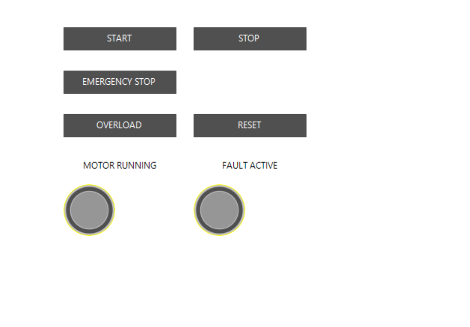

# codesys-motor-control
# PLC Motor Start/Stop and Fault Control

A simulated industrial motor-control system developed in **CODESYS** using **Ladder Logic (LD)** and **CODESYS Visualization**.

This project was created to practice fundamental PLC programming concepts including self-holding circuits, interlocks, fault memory, reset logic, and operator visualization.

## Features

* Motor START and STOP control
* Self-holding motor circuit
* Simulated Emergency Stop
* Simulated motor overload
* Stored overload fault using Set/Reset logic
* Fault reset only after the overload condition is removed
* Motor-running indicator
* Fault indicator
* Operator visualization/HMI

## Ladder Logic

### Network 1 — Motor Control

The motor can run only when:

* STOP is not active
* Emergency Stop is not active
* Overload is not active
* No stored fault is active

Pressing START energizes `MotorRunning`.

A parallel `MotorRunning` contact creates a self-holding circuit so the motor continues running after START is released.

### Network 2 — Fault Memory

When `Overload` becomes TRUE, the Set coil stores:

`FaultActive = TRUE`

The fault therefore remains active even after the overload input is removed.

### Network 3 — Fault Reset

The stored fault can only be reset when:

`ResetButton = TRUE`

and

`Overload = FALSE`

This prevents the operator from clearing the fault while the overload condition still exists.

### Network 4 — Running Indicator

`MotorRunning` controls the motor-running lamp.

### Network 5 — Fault Indicator

`FaultActive` controls the fault lamp.

## Visualization

The visualization provides controls for:

* START
* STOP
* EMERGENCY STOP
* OVERLOAD
* RESET

It also displays:

* MOTOR RUNNING status
* FAULT ACTIVE status

## Variables

| Variable        | Type | Purpose                            |
| --------------- | ---- | ---------------------------------- |
| `StartButton`   | BOOL | Motor start command                |
| `StopButton`    | BOOL | Motor stop command                 |
| `EmergencyStop` | BOOL | Simulated emergency-stop condition |
| `Overload`      | BOOL | Simulated motor-overload condition |
| `ResetButton`   | BOOL | Fault-reset command                |
| `MotorRunning`  | BOOL | Motor running state                |
| `FaultActive`   | BOOL | Stored fault memory                |
| `GreenLamp`     | BOOL | Motor-running indicator            |
| `RedLamp`       | BOOL | Fault indicator                    |

## Functional Testing

| Test                  | Expected Result                                    | Result |
| --------------------- | -------------------------------------------------- | ------ |
| Normal Start/Stop     | Motor starts, remains latched, and stops correctly | PASS   |
| Emergency Stop        | Motor stops and does not restart automatically     | PASS   |
| Overload Fault        | Motor stops and fault remains stored               | PASS   |
| Fault Reset           | Fault clears after overload is removed             | PASS   |
| Reset During Overload | Reset is blocked while overload remains active     | PASS   |

## Software

* CODESYS V3.5
* Ladder Logic (LD)
* CODESYS Visualization
* CODESYS Simulation

## Hardware

No physical hardware is required for this project.

The complete system was developed and tested using CODESYS simulation.

## Safety Note

The Emergency Stop used in this project is a **software simulation for educational purposes only**.

A real industrial Emergency Stop requires appropriate safety-rated hardware and safety systems and must not rely only on standard PLC software logic.
